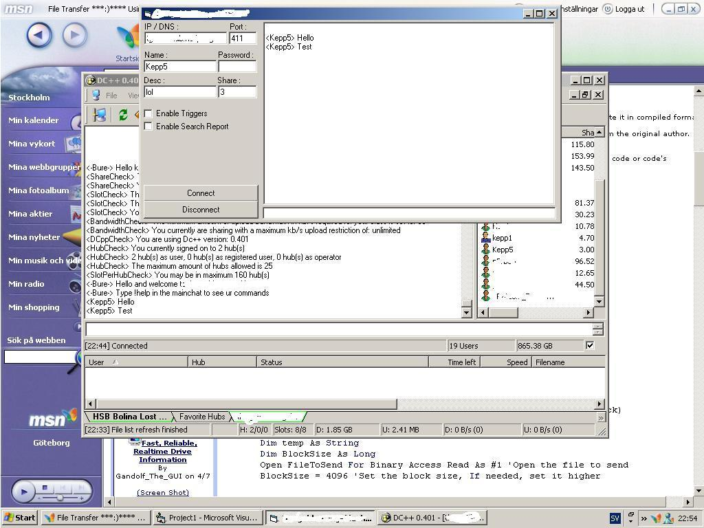



## Direct Connect Client

### Description

It's logging into a Hub on DC (Direct Connect)

It let's you talk and so on..

It's also very good for those that want to know

how the Direct COnnect Protocol works like..

How to make a connection, How to send data and so on..

Use with care and have fun..

(DO not forget to vote if you like / Learned from it)
 
### More Info
 

             |
---                |---
**Submitted On**   |2004-03-29 00:03:40
**By**             |[Jesper Kepp](https://github.com/Planet-Source-Code/PSCIndex/blob/master/ByAuthor/jesper-kepp.md)
**Level**          |Beginner
**User Rating**    |3.5 (14 globes from 4 users)
**Compatibility**  |VB 6\.0
**Category**       |[Complete Applications](https://github.com/Planet-Source-Code/PSCIndex/blob/master/ByCategory/complete-applications__1-27.md)
**World**          |[Visual Basic](https://github.com/Planet-Source-Code/PSCIndex/blob/master/ByWorld/visual-basic.md)
**Archive File**   |[Direct\_Con173036472004\.zip](https://github.com/Planet-Source-Code/jesper-kepp-direct-connect-client__1-52956/archive/master.zip)

